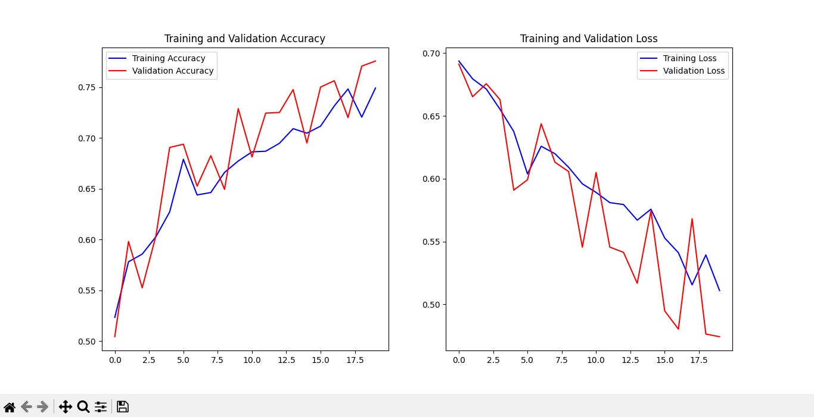

# 🐶🐱 Cats vs Dogs Classification using CNN (TensorFlow & Keras)

## 📌 Project Overview

This project implements a **Convolutional Neural Network (CNN)** using TensorFlow and Keras to classify images as either **Cat** or **Dog**. The model is trained using augmented image data and evaluated on a validation dataset.

The project demonstrates:

* Image preprocessing & augmentation
* CNN architecture design
* Model training & evaluation
* Accuracy/Loss visualization
* Custom image prediction function

---

## 🧠 Technologies Used

* Python
* TensorFlow
* Keras
* NumPy
* Matplotlib

---

## 📂 Dataset Structure

The dataset must be structured as follows:

```
training_set/
    training_set/
        cats/
        dogs/

test_set/
    test_set/
        cats/
        dogs/
```

Each folder should contain respective images.

---

## 🔄 Data Preprocessing

### Training Data Augmentation

* Rescaling (1./255)
* Rotation (40°)
* Width & Height shift (0.2)
* Shear transformation (0.2)
* Zoom (0.2)
* Horizontal flipping

### Validation Data

* Only rescaling (1./255)

---

## 🏗️ Model Architecture

The CNN consists of:

1. **Conv2D (32 filters, 2x2)** + MaxPooling
2. **Conv2D (64 filters, 3x3)** + MaxPooling
3. **Conv2D (128 filters, 3x3)** + MaxPooling
4. **Conv2D (128 filters, 3x3)** + MaxPooling
5. Flatten Layer
6. Dense Layer (512 units, ReLU)
7. Output Layer (1 unit, Sigmoid)

### Compilation

* Optimizer: Adam
* Loss Function: Binary Crossentropy
* Metric: Accuracy

---

## 🚀 Model Training

* Epochs: 20
* Steps per epoch: 100
* Validation steps: 50
* Batch size: 32
* Image size: 150x150

The training process stores history for visualization of:

* Training Accuracy
* Validation Accuracy
* Training Loss
* Validation Loss

---

## 📊 Training Results & Visualization

The project generates performance graphs using Matplotlib.

### 🔹 Accuracy & Loss Curves

```markdown

```


These graphs help analyze:

* Model convergence
* Overfitting / Underfitting
* Performance gap between training and validation

---

## 🔍 Custom Image Prediction

A function `predict_image()` allows classification of any external image.

Example:

```python
predict_image(model, 'cat.jpg')
```

Output Example:

```
The image is predicted to be a Dog with a confidence of 0.92
```

---

## ⚙️ How to Run

1. Clone the repository:

```
git clone <repo-link>
```

2. Install dependencies:

```
pip install tensorflow keras matplotlib numpy
```

3. Ensure dataset folders are correctly placed.

4. Run the script:

```
python main.py
```

---


## 📌 Learning Outcomes

Through this project, you will understand:

* CNN fundamentals
* Image augmentation techniques
* Binary image classification workflow
* Model performance analysis

---

## 👨‍💻 Author

Abdullah Ali
Computer Science Student | AI & ML Developer

---

⭐ If you found this project helpful, consider giving it a star!
